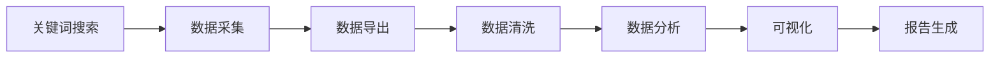

# MediaCrawler Skill

> **社交媒体数据采集与分析工具**
> **版本**: v1.0
> **位置**: /Users/echo/Desktop/大秘书系统/LIBRARY/MediaCrawler
> **支持平台**: 小红书、抖音、微博、知乎、B站、快手、贴吧

---

## 🎯 技能概述

MediaCrawler 是一个功能强大的社交媒体数据采集工具，可以从主流平台采集公开数据（笔记、评论、用户信息等），并支持数据清洗、分析和可视化。

### 核心能力

1. **数据采集**：多平台关键词搜索、指定笔记详情、用户主页数据
2. **数据导出**：Excel、JSON、CSV、SQLite 等多种格式
3. **数据分析**：数据清洗、统计分析、关键词提取
4. **可视化**：词云图、条形图、饼图、柱状图等
5. **报告生成**：自动生成 PPT 分析报告
6. **高赞内容生成** ⭐ NEW：竞品分析、爆款要素提取、话题库生成、创作指南

### 支持的平台

| 平台 | 搜索 | 笔记详情 | 二级评论 | 用户主页 | 词云图 |
|------|------|---------|---------|---------|--------|
| 小红书 | ✅ | ✅ | ✅ | ✅ | ✅ |
| 抖音 | ✅ | ✅ | ✅ | ✅ | ✅ |
| 微博 | ✅ | ✅ | ✅ | ✅ | ✅ |
| 知乎 | ✅ | ✅ | ✅ | ✅ | ✅ |
| B站 | ✅ | ✅ | ✅ | ✅ | ✅ |
| 快手 | ✅ | ✅ | ✅ | ✅ | ✅ |
| 贴吧 | ✅ | ✅ | ✅ | ✅ | ✅ |

---

## 🚀 快速开始

### ⚡ 一键采集（推荐）⭐⭐⭐（2026-02-01更新）

**快速采集脚本**：
```bash
cd /Users/echochen/MediaCrawler
./快速采集.sh "关键词" 数量

# 示例：
./快速采集.sh "无醇啤酒" 100
./快速采集.sh "左点睡眠仪" 20
```

**脚本功能**：
- ✅ 自动修改配置文件（KEYWORDS、CRAWLER_MAX_NOTES_COUNT）
- ✅ 使用CDP模式（复用登录状态）
- ✅ 自动下载图片（ENABLE_GET_MEIDAS=True）
- ✅ 无需手动编辑配置

### 基础使用（手动方式）

**采集小红书数据**:
```bash
cd /Users/echochen/MediaCrawler
vim config/base_config.py  # 修改KEYWORDS和CRAWLER_MAX_NOTES_COUNT
python3 main.py
```

**自定义采集数量**:
```bash
# 方法一：修改配置文件
vim config/base_config.py
# KEYWORDS = "无醇啤酒,0酒精啤酒"
# CRAWLER_MAX_NOTES_COUNT = 100
python3 main.py

# 方法二：使用快速脚本
./快速采集.sh "无醇啤酒" 100
```

**其他平台**:
```bash
# 微博
uv run main.py --platform wb --lt qrcode --type search --keywords "关键词"

# 知乎
uv run main.py --platform zhihu --lt qrcode --type search --keywords "关键词"

# 抖音
uv run main.py --platform douyin --lt qrcode --type search --keywords "关键词"
```

---

## ⚠️ 重要原则（2026-02-01更新）

### 数据一致性原则

**核心原则**：
> **全程使用MediaCrawler的数据，不要与其他来源混合**

**为什么重要？**

**失败案例**：
- 尝试将RPA采集的"左点睡眠仪"数据与MediaCrawler数据匹配
- 结果：匹配失败率100%
- 原因：
  - RPA版：一般睡眠内容
  - MediaCrawler：产品相关内容（"4小时原则是真的"）
  - 采集时间不同、关键词不同、排序逻辑不同

**正确做法**：
```python
# ✅ 正确：全程使用MediaCrawler
import json
import pandas as pd

# 读取MediaCrawler的JSON
with open('data/xhs/json/search_contents_2026-02-01.json', 'r') as f:
    data = json.load(f)

# 直接使用，不要尝试匹配其他数据源
df = pd.DataFrame(data)
df['liked_count_num'] = df['liked_count'].apply(convert_liked_count)
df_top20 = df.sort_values('liked_count_num', ascending=False).head(20)
```

**决策树**：
```
开始数据分析项目
    ↓
是否已有合适的数据？
    ├─ 是 → 直接使用，不要重新采集
    └─ 否 → 使用MediaCrawler采集
             ↓
         全程使用MediaCrawler数据
         不要混合其他来源
```

### 快速检查清单

每次采集前确认：
- [ ] 是否已有现成数据？（检查`data/xhs/json/`）
- [ ] 关键词是否正确？
- [ ] 采集数量是否合理？（建议20-100）
- [ ] 登录状态是否有效？
- [ ] 是否需要下载图片？

### 登录状态管理

**检查登录状态**：
```bash
# 检查Cookies文件
ls -lh /Users/echochen/MediaCrawler/browser_data/cdp_xhs_user_data_dir/Default/Cookies

# 如果不存在或过期（461错误码）
rm -rf /Users/echochen/MediaCrawler/browser_data/cdp_xhs_user_data_dir/
python3 main.py  # 重新扫码登录
```

**保持登录有效**：
- 登录态保持：7-30天
- 避免频繁登录（可能触发风控）
- 使用CDP模式自动复用登录态

---

## 📋 使用场景

### 场景 1: 市场调研

**任务**: 采集用户对某产品的反馈

**流程**:
1. 采集社交媒体数据（关键词搜索）
2. 数据清洗和整理
3. 情感分析（愿意/不愿意尝试的原因）
4. 消费场景分析
5. 品牌提及率分析
6. 生成分析报告

**示例**: 无醇啤酒小红书数据分析
- 采集 100 条笔记
- 获取 2,011 条评论
- 识别 4 大用户类型
- 分析 8 大消费场景

### 场景 2: 竞品分析

**任务**: 对比分析竞品在社交媒体上的表现

**流程**:
1. 采集竞品关键词数据
2. 品牌提及率分析
3. 用户反馈对比
4. 热门话题识别
5. 生成竞品分析报告

### 场景 3: 内容创作支持

**任务**: 为文章或视频提供数据支持

**流程**:
1. 采集相关话题的热门内容
2. 提取高频关键词和话题
3. 识别用户痛点和需求
4. 为内容创作提供真实数据

### 场景 3: 内容创作支持

**任务**: 为文章或视频提供数据支持

**流程**:
1. 采集相关话题的热门内容
2. 提取高频关键词和话题
3. 识别用户痛点和需求
4. 为内容创作提供真实数据

### 场景 4: 竞品内容分析与高赞内容生成 ⭐ NEW

**任务**: 通过分析竞品高赞内容，生成可套用的话题库和创作指南

**流程**:
1. 采集竞品关键词数据
2. 计算获客价值分（点赞+收藏×2+评论×3+分享×4）
3. 选取TOP50/100高赞内容
4. 提取爆款要素（标题、内容、封面）
5. 生成50个高赞话题库
6. 编写32条创作指南
7. 输出Excel报告（3个工作表）和Markdown报告

**输出物**:
- **TOP高赞案例表**：排名、标题、互动数据、获客价值分、爆款要素
- **高赞话题库**：50个可直接套用的话题，含标题公式、内容要点
- **内容创作指南**：9大模块32条核心要点
- **完整分析报告**：Markdown格式，含核心发现、创作流程、Q&A

**参考案例**: 律师获客高赞案例分析
- 位置：`/Users/echo/MediaCrawler/data/xhs/律师获客高赞案例TOP50.xlsx`
- 使用指南：`/Users/echo/MediaCrawler/data/xhs/reports/律师获客表格使用指南.md`

**适用行业**:
- 专业服务（律师、医生、咨询）
- 健康产品（睡眠仪、保健品、医疗器械）
- 消费品（食品、饮料、化妆品）
- 教育培训（课程、知识付费）

**方法论文档**: `~/Desktop/大秘书系统/CLAUDE_SYSTEM/SKILLS/竞品内容分析与高赞内容生成方法论文档.md`

### 场景 5: 趋势监测

**任务**: 监测某个话题的趋势变化

**流程**:
1. 定期采集关键词数据
2. 时间序列分析
3. 热度变化追踪
4. 趋势预测

---

## 🔧 配置说明

### 核心配置文件

**位置**: `/Users/echo/Desktop/大秘书系统/LIBRARY/MediaCrawler/config/base_config.py`

**关键参数**:
```python
# 关键词（英文逗号分隔）
KEYWORDS = "无醇啤酒,0酒精啤酒"

# 采集数量
CRAWLER_MAX_NOTES_COUNT = 100

# 每篇笔记评论数
CRAWLER_MAX_COMMENTS_COUNT_SINGLENOTES = 30

# 请求间隔（秒）- 不建议低于3秒
CRAWLER_MAX_SLEEP_SEC = 5

# 输出格式：json, excel, csv, sqlite, db
SAVE_DATA_OPTION = "excel"
```

### 小红书专用配置

**位置**: `/Users/echo/Desktop/大秘书系统/LIBRARY/MediaCrawler/config/xhs_config.py`

**排序方式**:
```python
# 热门降序（点赞量最高）
SORT_TYPE = "popularity_descending"

# 最新降序（时间最新）
# SORT_TYPE = "time_descending"
```

---

## 📂 数据存储位置

### Excel 文件（推荐）

**位置**: `/Users/echo/Desktop/大秘书系统/LIBRARY/MediaCrawler/data/xhs/`

**文件结构**:
```
xhs_search_YYYYMMDD_HHMMSS.xlsx
├── Sheet1: Contents（笔记内容）
│   ├── 标题、正文、点赞数、收藏数、评论数、分享数
│   ├── 作者信息、发布时间、笔记类型
│   └── 热度指标（总热度 = 点赞+收藏+评论+分享）
├── Sheet2: Comments（评论内容）
│   ├── 评论内容、点赞数、发布时间
│   ├── 评论者信息、是否回复
│   └── 热度排名
└── Sheet3: Creators（作者信息）
    ├── 用户昵称、简介、粉丝数、获赞数
    ├── 笔记数、收藏数
    └── IP归属地
```

### JSON 文件

**位置**: `/Users/echo/Desktop/大秘书系统/LIBRARY/MediaCrawler/data/xhs/search/`

**用途**: 程序化处理和数据交换

---

## 🛠️ 辅助工具

### 数据合并去重

**脚本**: `/Users/echo/merge_excel_data.py`

**使用**:
```bash
# 合并小红书数据
python3 /Users/echo/merge_excel_data.py xhs

# 合并所有平台
python3 /Users/echo/merge_excel_data.py --all
```

### 数据分析

**脚本**: `/Users/echo/analyze_data.py`

**使用**:
```bash
python3 /Users/echo/analyze_data.py \
  /Users/echo/Desktop/大秘书系统/LIBRARY/MediaCrawler/data/xhs/xhs_search_*.xlsx
```

**输出**:
- 数据清洗报告
- 统计分析结果
- 可视化图表

### 批量采集

**脚本**: `/Users/echo/batch_crawl.sh`

**使用**:
```bash
# 采集小红书（默认20条）
/Users/echo/batch_crawl.sh xhs

# 自定义关键词和数量
/Users/echo/batch_crawl.sh xhs "关键词" 50
```

---

## 📊 数据分析工作流

### 完整流程



### 步骤说明

**1. 数据采集**
```bash
cd /Users/echo/Desktop/大秘书系统/LIBRARY/MediaCrawler
uv run main.py --platform xhs --lt qrcode --type search \
  --keywords "关键词" \
  --crawler_max_notes_count 100
```

**2. 数据清洗**
```python
# 时间戳转换
timestamp_to_date(ts)

# 新增字段
- publish_date: 发布时间
- total_engagement: 总热度
- content_length: 内容长度
- engagement_level: 热度等级
- is_reply: 是否回复
```

**3. 数据分析**
```python
# 统计分析
- 消费者意愿分布（愿意/不愿意）
- 关键驱动因素（口感、场景、品牌）
- 用户画像（社交型、实用型、健康型、体验型）
- 消费场景排名
- 品牌提及率
```

**4. 可视化**
```python
# 词云图
- 高频关键词提取
- jieba 分词
- matplotlib 可视化

# 统计图表
- 饼图（消费者意愿分布）
- 条形图（驱动因素排名）
- 柱状图（消费场景分析）
```

**5. 报告生成**
```python
# PPT 报告
- html2pptx 生成演示文稿
- 自动排版
- 配色方案：Teal & Coral
```

---

## 🎨 项目案例：无醇啤酒分析

### 项目概况

- **数据规模**: 100 条笔记 + 2,011 条评论
- **分析维度**: 6 大维度
- **可视化**: 5 张图表
- **报告**: 10 页 PPT

### 核心发现

**1. 消费者意愿**:
- 愿意尝试：78.6%
- 不愿意尝试：21.4%

**2. 关键驱动因素**:
- 口感好：50.7%
- 社交/聚会：11.1%
- 健身/减肥：9.0%

**3. 消费场景 TOP8**:
1. 聚会（82次）
2. 开车（49次）
3. 健身（39次）
4. 夏天（35次）
5. 宵夜（32次）
6. 火锅（28次）
7. 居家（24次）
8. 减肥（22次）

**4. 品牌提及率**:
- 新零：26.8%
- 青岛无醇：13.4%
- 其他：57.7%

### 交付成果

**数据文件**:
- 原始数据：`xhs_search_20260126_162338.xlsx`
- 清洗后数据：`xhs_search_20260126_162338_cleaned.xlsx`

**可视化图表**:
- `data_analysis_report.png`
- `consumption_scenarios_analysis.png`
- `consumer_insights_analysis.png`
- `xinling_brand_analysis.png`
- `consumer_intent_analysis.png`

**PPT 报告**:
- `无醇啤酒消费者意愿与场景语义分析.pptx`（10页）

---

## ⚠️ 注意事项

### 采集限制

**反爬虫机制**:
- 请求间隔不低于 3 秒（推荐 5 秒）
- 单次采集不超过 500 条
- 避免频繁采集同一关键词

**登录态保持**:
- 扫码登录后，登录态保持 7-30 天
- 登录信息保存在：`browser_data/cdp_xhs_user_data_dir/`
- 如遇 461 状态码，等待 1-2 小时后重试

### 数据质量

**数据清洗**:
- 时间戳转换（毫秒 → 日期时间）
- 去重（笔记 ID、评论 ID）
- 异常值处理
- 缺失值填充

**数据验证**:
- 检查数据完整性
- 验证数值范围
- 确认时间序列正确性

---

## 🔗 与其他 Agent 的协作

### 与知识Agent协作

**场景**: 网络调研时采集社交媒体数据

**流程**:
1. 知识Agent 识别调研需求
2. 调用 MediaCrawler skill 采集数据
3. 知识Agent 分析数据并生成调研报告

**示例**:
```
你："调研一下无醇啤酒在小红书的用户反馈"
→ 知识Agent 调用 MediaCrawler
→ 采集小红书数据
→ 生成调研报告
```

### 与数据分析Agent协作

**场景**: 社交媒体数据分析

**流程**:
1. 数据分析Agent 定义分析需求
2. 调用 MediaCrawler skill 采集数据
3. 数据清洗和分析
4. 生成可视化图表和报告

**示例**:
```
你："分析小红书上AI编程话题的趋势"
→ 数据分析Agent 调用 MediaCrawler
→ 采集历史数据
→ 时间序列分析
→ 生成趋势报告
```

### 与写作Agent协作

**场景**: 为文章提供数据支持

**流程**:
1. 写作Agent 识别需要数据支持
2. 调用 MediaCrawler skill 采集相关数据
3. 提取关键数据点
4. 嵌入文章内容

**示例**:
```
你："写一篇关于无醇啤酒市场的分析文章"
→ 写作Agent 调用 MediaCrawler
→ 采集市场数据
→ 提取关键洞察
→ 基于真实数据创作文章
```

### 与项目Agent协作

**场景**: 创建数据分析项目

**流程**:
1. 项目Agent 创建项目框架
2. 调用 MediaCrawler skill 采集数据
3. 整合数据分析、可视化、报告生成
4. 项目进度追踪和归档

**示例**:
```
你："创建一个数据分析项目，分析无醇啤酒市场"
→ 项目Agent 创建项目
→ 调用 MediaCrawler 采集数据
→ 数据分析Agent 生成报告
→ 项目归档
```

---

## 📈 后续优化方向

### 功能增强

- [ ] 支持更多平台（Instagram、Twitter）
- [ ] 增加情感分析（正面/负面/中性）
- [ ] 自动化报告生成（Markdown + PPT）
- [ ] 实时监测和预警
- [ ] API 接口封装

### 性能优化

- [ ] 并发采集（多账号 + IP 代理池）
- [ ] 断点续爬功能
- [ ] 增量更新（只采集新数据）
- [ ] 数据缓存机制

### 分析增强

- [ ] 机器学习模型（用户画像、趋势预测）
- [ ] 网络分析（KOL 识别、传播路径）
- [ ] 地域分布分析
- [ ] 时间序列分析（季节性、周期性）

---

## 📞 参考文档

**本地文档**:
- `/Users/echo/Desktop/大秘书系统/LIBRARY/MediaCrawler/README.md` - 项目说明
- `/Users/echo/Desktop/大秘书系统/LIBRARY/MediaCrawler/使用指南.md` - 使用指南
- `/Users/echo/Desktop/大秘书系统/LIBRARY/MediaCrawler/项目档案_无醇啤酒小红书数据分析.md` - 项目案例

**GitHub**:
- https://github.com/NanmiCoder/MediaCrawler
- Issues: https://github.com/NanmiCoder/MediaCrawler/issues

---

## 🎯 总结

MediaCrawler 是一个强大的社交媒体数据采集与分析工具，可以：

✅ 多平台数据采集（小红书、抖音、微博、知乎等）
✅ 数据清洗和整理
✅ 统计分析和可视化
✅ 自动生成报告
✅ 与其他 Agent 协作完成复杂任务

**最佳实践**:
1. 简单任务：直接使用 MediaCrawler skill
2. 复杂项目：MediaCrawler + 数据分析项目模板
3. Agent 协作：通过项目Agent协调多Agent完成任务

---

**Skill 版本**: v1.2
**最后更新**: 2026-02-01
**状态**: ✅ 已完成，可以使用

**版本历史**：
- v1.2 (2026-02-01):
  - ✅ 新增快速采集脚本（`快速采集.sh`）
  - ✅ 新增数据一致性原则
  - ✅ 新增登录状态管理指南
  - ✅ 完善CDP模式说明
  - ✅ 添加快速检查清单
- v1.1 (2026-01-29):
  - ✅ 新增竞品内容分析与高赞内容生成（能力6）
- v1.0 (2026-01-26):
  - ✅ 基础社交媒体数据采集功能
